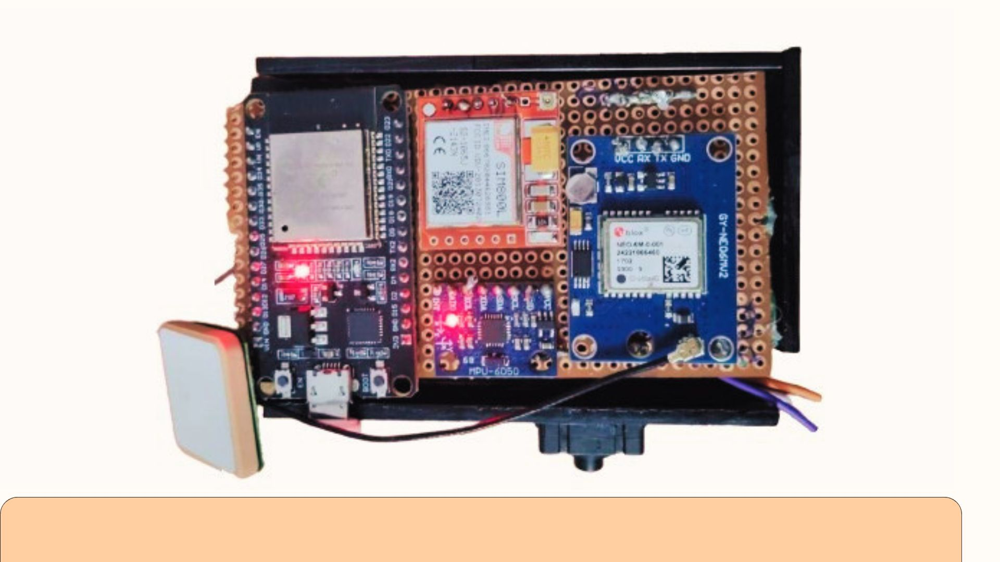

# 👟 SafeStep – AI-Enabled Smart Shoe for Women and Kids Safety

SafeStep is an AI-powered smart wearable designed to ensure personal safety for women and children. By integrating sensors, IoT, and machine learning, the shoe detects physical emergencies like fainting, abnormal vitals, or panic button presses, and instantly alerts guardians with live location.

---

## 🔒 Key Features

- 📡 **Emergency Detection via ML**: Predicts abnormal or suspected user conditions using heart rate, SpO2, motion, and orientation data.
- 🧠 **Custom Trained ML Model**: Classifies physical states as normal, abnormal, or suspected abnormal.
- 🔘 **Single Press Alert System**: Button press triggers instant guardian notification.
- 🌍 **Geofencing Alerts**: Sends real-time alerts when user crosses predefined safe zones.
- 🔄 **Real-time Communication**: Emergency signals and live location sent using WebSocket.
- 🛠️ **IoT Integration**: Connected to ESP32, MAX30102, MPU6050 for real-time data gathering.

---

## 🧠 Machine Learning

- Model Type: Multi level Perceptron(MLP)
- Input Parameters: Heart Rate, SpO2, Accelerometer (x/y/z), Gyroscope (x/y/z)
- Output Labels: Normal, Abnormal, Suspected Abnormal
- Tools Used: TensorFlow, TinyML

---

## 🛠️ Tech Stack

- **Backend**: Node.js, Express.js
- **Database**: MongoDB
- **ML Model**: TensorFlow
- **IoT Devices**: ESP32, MAX30102 (Heart Rate & SpO2), MPU6050 (Gyro + Accelerometer)

---

## 📸 Images

### 🧩 Prototype Circuit Setup

---

## 🎥 Demo Videos

### 🔘 Single Press Emergency Notification
[

### 🧠 ML Model Live Detection
[

### 🌍 Geofencing Alert Trigger
[

---

